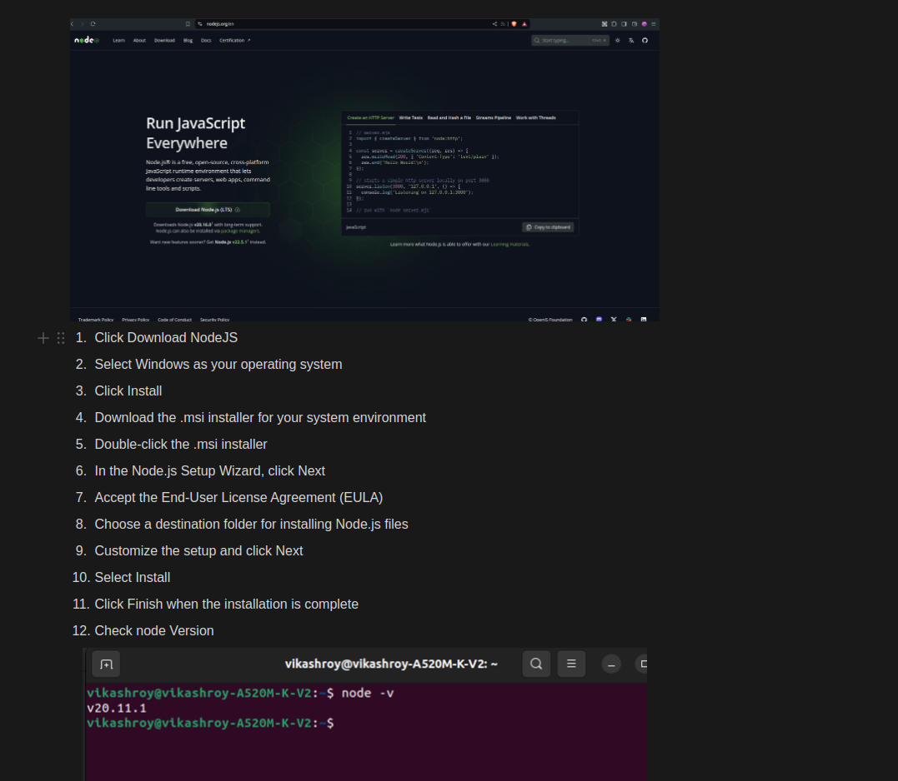
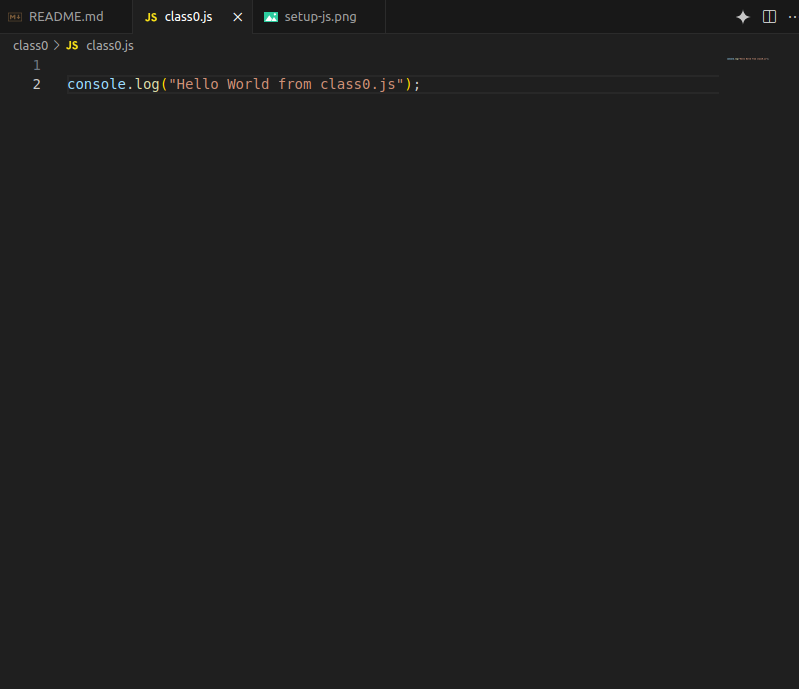

### What is JavaScript
- JavaScript is a programming language used to create interactive and dynamic web pages, enabling client-side scripting and server-side development.

## Top Programming languages
-   

## Uses of JavaScript

1. **Web Development:** JavaScript is used to create interactive elements on websites, such as forms, animations, and dynamic content updates.

2. **Web Applications:** It's essential for building single-page applications (SPAs) like Gmail and Google Maps, offering smooth and responsive user experiences.

3. **Server-Side Development:** With Node.js, JavaScript can be used on the server side to handle backend operations, including databases and APIs.

4. **Game Development:** JavaScript is used to develop browser-based games, providing graphics, user interaction, and game logic.

5. **Mobile App Development:** Frameworks like React Native and Ionic allow developers to build cross-platform mobile apps using JavaScript.

## Setup NodeJs in Local Machine
 

## Writing first code in js
